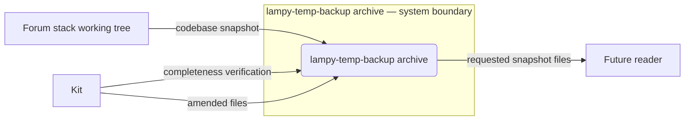
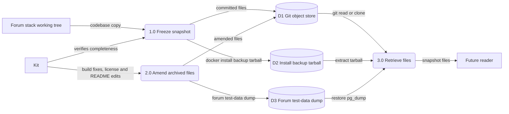
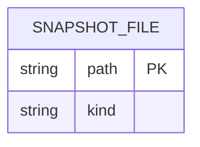

Living document — update these diagrams when adding features.

# lampy-temp-backup — Architecture

lampy-temp-backup is a static backup snapshot of the Lampy forum-stack codebase, frozen 2026-09-21 and amended in place since (build fixes 2026-09-23→26, license/README curation 2026-09-26/27). Its repo description says: "Backup of the Lampy forum-stack codebase (verified complete 2026-09-21); build parked pending administrator training." It is not active development — it archives the working tree plus two binary artifacts — `backups/docker-install-backup-2026-09-19.tar.gz` and `lampy-forum-test-data.zip` (a pg_dump of the forum DB) — plus a mirrored copy of the lampy-single Docker files. There is no runtime, no pipeline, and no data model of its own. 44 commits total; HEAD is the SAD doc commit of 2026-09-28.

## 1. Context diagram (level 0)

The "system" is a storage location — a read-only archive of a codebase snapshot.

## 2. Level-1 data flow diagram

Three processes: freeze the snapshot once, amend it in place afterwards, and read from it later. Nothing runs here.

## 3. Entity–relationship diagram

No persistent data model observed — the repo is a file archive; the `schema.sql` files inside it (e.g. under `payments/`) belong to the archived applications, not to this repo. The only structure is the committed file tree (136 entries at HEAD):

`kind` is "text file" for the 106 tracked source/doc files, "tarball" for `backups/docker-install-backup-2026-09-19.tar.gz`, and "zip archive" for `lampy-forum-test-data.zip` (a pg_dump of the forum DB, added 2026-09-24). Single entity, no relationships — there is nothing else to model. (Live tree: 136 entries = 108 blobs + 28 directory entries; 108 − 2 binary artifacts = 106 text files.)

## Grounding notes

- OBSERVED: repo description (via API): "Backup of the Lampy forum-stack codebase (verified complete 2026-09-21); build parked pending administrator training."
- OBSERVED: HEAD tree (main, recursive) has 136 entries. Top-level files: `.dockerignore`, `.gitignore`, `BUGLOG.md`, `LICENSE`, `LICENSE.md`, `NOTATION_LEDGER.md`, `README.md`, `TERMS_OF_USE.md`, `WORKFLOW.md`, `docker-compose.yml`, `env.sh`, `lampy-forum-test-data.zip`. Top-level dirs: `backups/`, `c-ide/`, `control-files/`, `control-plane/`, `db-console/`, `docs/`, `hidden_files/`, `history/`, `httpd/`, `ide/`, `installer/`, `lampy-python/`, `lampy-single/` (mirrored Docker build files), `musey/`, `payments/`. Nested doc file observed: `docs/architecture.md`.
- OBSERVED: two binary artifacts — `backups/docker-install-backup-2026-09-19.tar.gz` (install backup tarball) and `lampy-forum-test-data.zip` (added by commit 09c36a63, 2026-09-24: "Add Lampy forum test data (pg_dump of forum DB, 2026-09-24)").
- OBSERVED: the README (573 lines) is the forum-stack network administrator setup guide (build prerequisites, WSL2/Windows split topology, database, mail server, forum app) — documentation captured with the snapshot, not a spec of this repo itself.
- OBSERVED: post-freeze history is not just curation — commits 2026-09-23→26 amended the mirrored build (32ebd327 code-server PASSWORD fallback, 05a23d0f pgai-worker/James fixes, 4ec62d00 "Build v2 attempt 4" wheelhouse install, 08c43619 James `-Dworking.directory`, def8db81 vendored Ollama donor files); curation-only commits followed on 2026-09-26/27 (aa48be91, 2d218306 license files; d9180efb README password redaction); then the SAD doc commit 2026-09-28.
- INFERRED: the "future reader" restoring from this archive — the intended use (restore or reference) is stated nowhere explicitly; the repo description implies it.
- INFERRED: snapshot completeness was verified by Kit 2026-09-21 — stated in the repo description; I did not independently verify file-by-file completeness.
