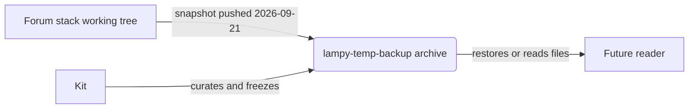
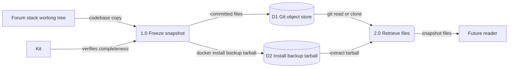
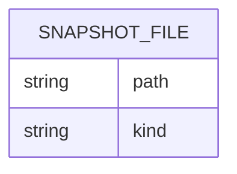

Living document — update these diagrams when adding features.

# lampy-temp-backup — Architecture

lampy-temp-backup is a static backup snapshot of the Lampy forum-stack codebase, frozen 2026-09-21. Its own repo description says: "Backup of the Lampy forum-stack codebase (verified complete 2026-09-21); build parked pending administrator training." It is not active development — it archives the working tree (control-plane, db-console, installer, payments module, docs, and a `backups/docker-install-backup-2026-09-19.tar.gz` tarball) plus a mirrored copy of the lampy-single Docker files. There is no runtime, no pipeline, and no data model of its own.

## 1. Context diagram (level 0)

The "system" is a storage location — a read-only archive of a codebase snapshot.

## 2. Level-1 data flow diagram

Two processes only: freeze the snapshot once, and read from it later. Nothing runs here.

## 3. Entity–relationship diagram

No persistent data model observed — the repo is a file archive; the `schema.sql` files inside it (e.g. under `payments/`) belong to the archived applications, not to this repo. The only structure is the committed file tree:

## Grounding notes

- OBSERVED: repo description (via API): "Backup of the Lampy forum-stack codebase (verified complete 2026-09-21); build parked pending administrator training."
- OBSERVED: HEAD tree has 134 entries, including top-level dirs `backups/`, `control-plane/`, `db-console/`, `control-files/`, `installer/`, `lampy-python/`, `lampy-single/` (mirrored Docker build files), `musey/`, `payments/`, plus `WORKFLOW.md`, `BUGLOG.md`, `NOTATION_LEDGER.md`, `docker-compose.yml`, `env.sh`.
- OBSERVED: `backups/docker-install-backup-2026-09-19.tar.gz` is the only binary artifact — an install backup tarball committed into the tree.
- OBSERVED: the README is the forum-stack network administrator setup guide (25 KB, sections on build prerequisites, WSL2/Windows split topology, database, mail server, forum app) — documentation captured with the snapshot, not a spec of this repo itself.
- OBSERVED: recent commits (2026-09-26/27) touch license files and README redaction; no code changes — consistent with a frozen archive under light curation.
- INFERRED: the "future reader" restoring from this archive — the intended use (restore or reference) is stated nowhere explicitly; the repo description implies it.
- INFERRED: snapshot completeness was verified by Kit 2026-09-21 — stated in the repo description; I did not independently verify file-by-file completeness.
